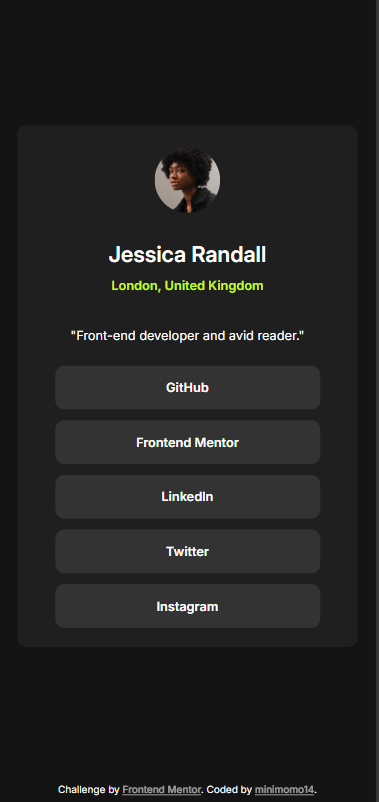
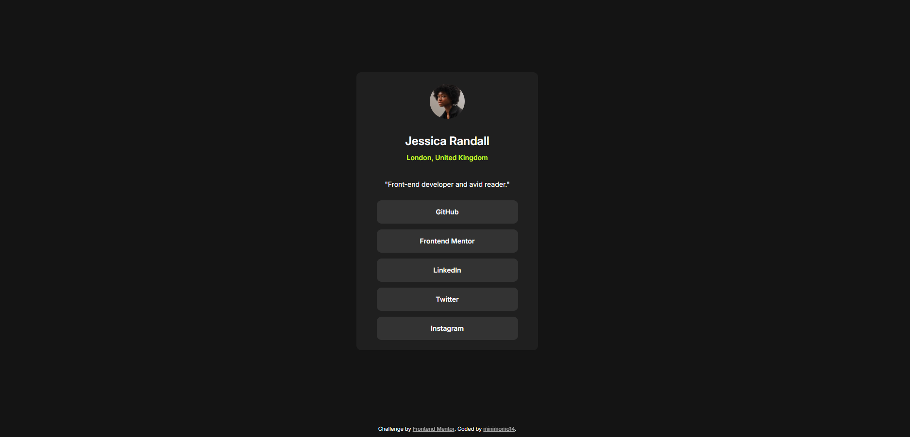
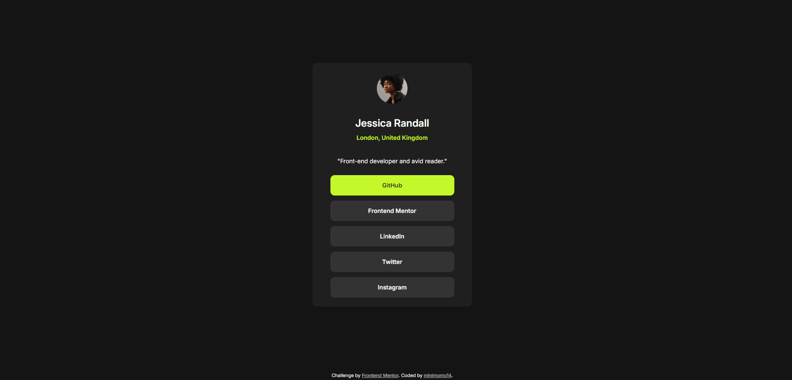

# Frontend Mentor - Social links profile solution

This is a solution to the [Social links profile challenge on Frontend Mentor](https://www.frontendmentor.io/challenges/social-links-profile-UG32l9m6dQ). Frontend Mentor challenges help you improve your coding skills by building realistic projects. 

## Table of contents

- [Overview](#overview)
  - [The challenge](#the-challenge)
  - [Screenshot](#screenshot)
  - [Links](#links)
- [My process](#my-process)
  - [Built with](#built-with)
  - [What I learned](#what-i-learned)
  - [Continued development](#continued-development)
  - [Useful resources](#useful-resources)
- [Author](#author)

## Overview

### The challenge

Users should be able to:

- See hover and focus states for all interactive elements on the page

### Screenshot

Mobile 

Desktop

Hover Effect

### Links

- Solution URL: (https://github.com/minimomo14/social-links-profile)
- Live Site URL: [Add live site URL here](https://your-live-site-url.com)

## My process

### Built with

- Semantic HTML5 markup
- CSS custom properties
- Flexbox
- CSS 
- Mobile-first workflow

### What I learned

HTML Structure and Semantics:

Understanding of elements: Deepen knowledge of elements like header, , main, footer, and their roles in structuring content.
Semantic markup: Learn the importance of using appropriate semantic elements (e.g.), section, div to improve accessibility and SEO.
2. CSS Styling and Layout:

Styling techniques: Practice using CSS properties like background-color, color, font-family, font-size, padding, margin, border, display, and flexbox to create visually appealing designs.
Layout methods: Experiment with different layout techniques, such as flexbox and CSS Grid, to arrange elements effectively.
Responsive design: Understand how to make your design adaptable to various screen sizes using media queries and responsive techniques.

### Continued development

Once I've completed this project , here are some areas that I wanted to continued explore for further learning and growth:

Deepening HTML and CSS Skills
Advanced CSS techniques: Dive deeper into CSS frameworks like Bootstrap or Foundation for more efficient and responsive layouts.
CSS preprocessors: Explore Sass or Less to write more organized and maintainable CSS code.
Accessibility best practices: Learn about ARIA attributes and other techniques to make your website more accessible to users with disabilities.

## Author

- Website - [minimomo14](https://minimomo14.github.io/momo-1.0.0/)
- Frontend Mentor - [@minimomo14](https://www.frontendmentor.io/profile/minimomo14)

